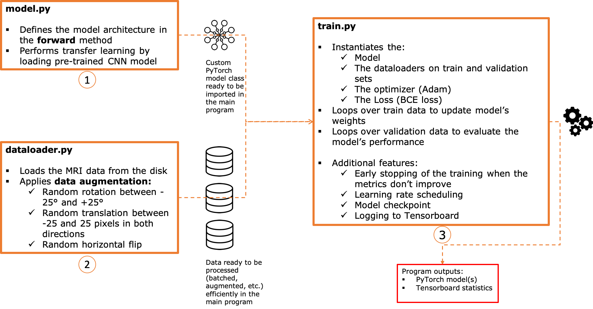
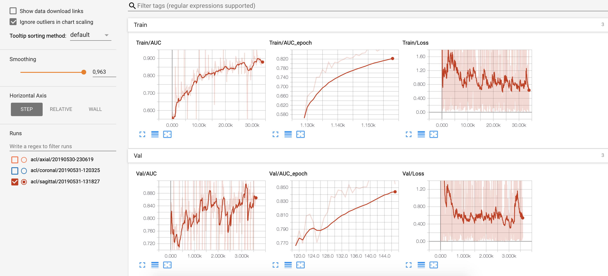

[](https://github.com/ahmedbesbes/character-based-cnn/blob/master/LICENSE)
[](https://github.com/ahmedbesbes/mrnet)
[](https://twitter.com/ahmed_besbes_)
[](https://github.com/ahmedbesbes/mrnet/stargazers)


# Deep learning in medical imaging: How to automate the detection of knee injuries in MRI exams ? 

This repository contains an implementation of a convolutional neural network that classifies specific knee injuries from MRI exams.

## Dataset: MRNet 

The data comes from Stanford ML Group research lab. It consits of 1,370 knee MRI exams performed at Stanford University Medical Center to study the presence of Anterior Cruciate Ligament (ACL) tears.

For more information about the ACL tear problem and the MRNet data please refer to my blog post where you can investigate the data and build the following data visualization in jupyter notebook:


<p align="center">
    
</p>

To learn more about the data and how to realize this visualization widget, read <a href="https://ahmedbesbes.com/automate-the-diagnosis-of-knee-injuries-with-deep-learning-part-1-an-overview-of-the-mrnet-dataset.html">my first post.</a>

## Code structure:

This charts summarizes the architecture of the project:



For more details about the code, please refer to my blog post.

## How to use the code:

If you want to retrain the network on your own you have to ask for the data from Stanford via this <a href="https://stanfordmlgroup.github.io/competitions/mrnet/">link</a>.

Once you download the data, create a `data` folder and place it at the root of the project. You should have two folders inside: `train` and `valid` as well as a bunch of csv files.

To run the script you can execute it with the following arguments:

```python
parser = argparse.ArgumentParser()
parser.add_argument('-t', '--task', type=str, required=True,
                    choices=['abnormal', 'acl', 'meniscus'])
parser.add_argument('-p', '--plane', type=str, required=True,
                    choices=['sagittal', 'coronal', 'axial'])
parser.add_argument('--augment', type=int, choices=[0, 1], default=1)
parser.add_argument('--lr_scheduler', type=int, choices=[0, 1], default=1)
parser.add_argument('--epochs', type=int, default=50)
parser.add_argument('--lr', type=float, default=1e-5)
parser.add_argument('--flush_history', type=int, choices=[0, 1], default=0)
parser.add_argument('--save_model', type=int, choices=[0, 1], default=1)
parser.add_argument('--patience', type=int, choices=[0, 1], default=5)
```

example to train a model to detect acl tears on the sagittal plane for a 20 epochs:

`python -t acl -p sagittal --epochs=20`

Note: Before running the script, add the following (empty) folders at the root of the project:
- models
- logs


## Results:

I trained an ACL tear classifier on a sagittal plane and got the following AUC scores:

- on train: 0.8669
- on validation: 0.8850

Logs on Tensorboard:




## Contributions - PR are welcome:

If you feel that some functionalities or improvements could be added to the project, don't hesitate to submit a pull request.

